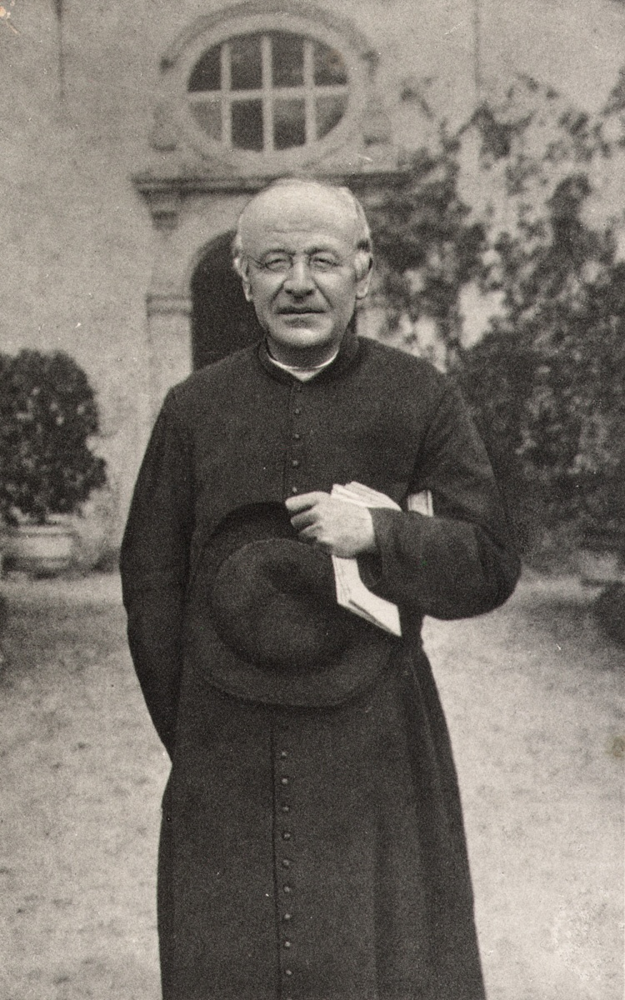

# Wat te doen, zien en beleven in Brugge?

## Nieuws en evenementenj 

- [Gitaarconcert Alexander Makay](https://www.brugge.be/activiteiten/alexander-makay-recuerdos-de-espana)

- Kunsthal BRUSK opent op 8 mei 2026 naast het Groeningemuseum

- Zaterdagmarkt: de Vrijdagmarkt en Hauwerstraat (naast het concertgebouw)
    - van 8:00 tot 13:30

- Folkloremarkt Dijver
    - _Verkoop tweedehands koopwaar van minstens vijftig jaar oud en zelfvervaardigde afgewerkte producten van een folkloristisch of kunstberoep_

- De bijaard speelt sinds kort [nieuwe melodiën](https://www.brugge.be/nieuws/brugse-beiaard-krijgt-nieuwe-melodieen) heeft. Het mechanische systeem, dat dateert uit 1748, kent zijn beperkingen, waardoor ritmische precisie niet altijd mogelijk is. Voor de zwaarste basklok is het wachten tot het kwartier voor het uur. Dan speelt immers de **verrassingssymfonie** van Joseph Haydn.

## De twaalf klassiekers

### Het begijnhof
De kloostertuin werd gesticht in 1245 en is vandaag gratis te bezoeken. Er wonen nog enkele Benedictijnse zusters, enkele zusters van de Orde Sint Vincentius A Paulo en enkele alleenstaande vrouwen. Werelderfgoed.

### De Brugse Reien
Ontlenen hun naam aan de [Reie](https://nl.wikipedia.org/wiki/Reie), die vroeger door de stad stroomde.
### Concertgebouw

### De Burg

Het majestueuze plein dat 'afgezoomd is met monumentale pronkgebouwen': de Basiliek van het Heilig Bloed, het Landhuis, het Brugse Vrije en de Proosdij. 
Een architectuursamenvatting op één plein.
Het Brugse stadsbestuur zetelt nog steeds in het 14de-eeuwse stadhuis.

Oorspronkelijk was het een omwalde burcht voorzien van toegangspoorten. 
Het vervulde twee functies: de zuidelijke helft had een civiele functie en de noordelijke een kerkelijke.
In 1967 werd op de Burg een bomaanslag gepleegd.
De zaak is nooit opgehelderd.

De Civiele Griffie is een van de oudste renaissancegebouwen in Vlaanderen.
Het werd voltooid in 1537 en kende drie restauraties.
Vanboven prijkt vrouwe Justitia, verwijzend naar de functie van het gebouw in de [rechtspraak](griffie.md).

Ook op het plein te bezichtigen is de Heilig-Bloedbasiliek en de voormalige Sint-Donaasproosdij.
Onder de basiliek ligt een volledig bewaarde Romaanse kerk, gewijd aan de heilige Basilius.
Het relikwie van het Heilig Bloed dat er wordt bewaard, wordt elk jaar met Hemelvaarstdag rondgedragen in de Heilig Bloedprocessie.
Voor de resten de in 1799 afgebroken Sint-Donaaskathedraal, moet je je begeven naar de kelders van het Crowne Plaza hotel.

### Vlaamse Primitieven

De kunst uit de 15de eeuw, de gouden eeuw van Brugge, hangt niet alleen in musea (het Groeningemuseum, Museum Sint-Janshospitaal), maar ook in kerken.
In de O.L.V. Kerk vind je bijvoorbeeld een 'Madonna met Kind' van Michelangelo, maar ook:
- het praalgraf van Maria van Bourgondië en haar vader Karel de Stoute uit de 15de en 16de eeuw 
- het ‘Passiedrieluik’ van Bernard van Orley en Marcus Gheeraerts dat het lijdensverhaal van Christus uitbeeldt.
- de bidkapel van Lodewijk van Gruuthuse. Deze privékapel, gebouwd in 1470, verbindt de kerk met het naastgelegen Gruuthusepaleis. Zo kon de familie Gruuthuse kerkdiensten bijwonen zonder hun huis te verlaten. 
- tenslotte: met 115 meter is de kerktoren de op één na hoogste bakstenen kerktoren ter wereld  
_disclaimer: de kerk kost 10 euro voor volwassenen_

Een overzicht van andere werken en waar ze te vinden:
- **Adornesdomein en Jeruzalemkapel**
- **Hof Bladelin**
- **Kerk en Klooster van de Ongeschoeide Karmelieten**

### Godshuizen

### Gruuthusemuseum

### Hanzekwartier

### Markt

### Minnewater

### Museum van de O.L.V-kerk

### Rozenhoedkaai

## Erfgoed
## de Guido Gezellestad

> Dit is dan weer een prachtige quote van Gezelle

## Eten
